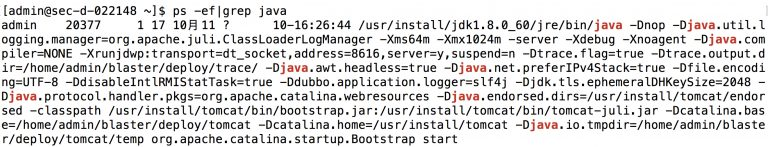
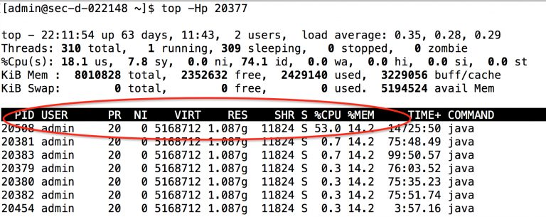
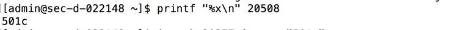
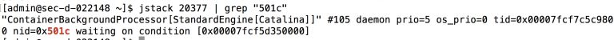

# 1.概览
> 在线上生产环境中经常会遇到各式各样的问题，遇到线上问题时不知道如何下手才好，偶尔的请教别人虽然可以，但是自己掌握相关的方法论，有助于自己的提升。不至于遇到线上问题时像个无头苍蝇，孤立无助

# 2.排查步骤
## 2.1 查找 java 应用的进程号

## 2.2 找到最耗 CPU 的线程

进程20377内，最耗CPU的线程PID为20508

## 2.3 将线程PID转换成十六进制
>java线程中线程PID使用的是十六进制的，所以先将PID转换成十六进制，再根据它查询相关信息

## 2.4 查看堆栈中线程详细信息

